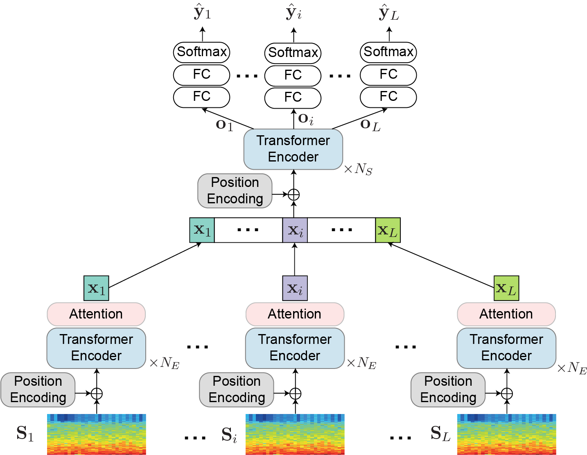

# SleepTransformer
- Huy Phan, Kaare Mikkelsen, Oliver Y. Chén, Philipp Koch, Alfred Mertins, and Maarten De Vos. [__SleepTransformer: Automatic Sleep Staging With Interpretability and Uncertainty Quantification.__](https://ieeexplore.ieee.org/document/9697331) _IEEE Transactions on Biomedical Engineering (TBME)_, vol. 69, no. 8, pp. 2456-2467, 2022. [[PDF]](https://ieeexplore.ieee.org/document/9697331) [[Preprint]](https://arxiv.org/abs/2105.11043)  

 These are source code and experimental setup for [SHHS](https://sleepdata.org/datasets/shhs).

How to use:
-------------
1. Download the database [SHHS](https://sleepdata.org/datasets/shhs). This may require to apply for licences. Information on how to obtain it can be found in the corresponding website.
1. To prepare data
run `shhs_data.m`
2. Split data and generate file lists
run `data_split_eval.m`
run `genlist_scratch_training.m` (Not: I have included the "data_split_eval.mat" file and the "file_list" folder, you dont have to run this step again)
3. Training and evaluation
run bash scripts in "scratch_training/sleeptransformer". The environment I used was Tensorflow 1.13, Python 3.7
4. Run matlab scripts in "evaluation" folders to aggregate the network outputs and compute metrics
for example, run aggregate_sleeptransformer.m

Environment:
-------------
- Matlab v7.3 (for data preparation)
- Python3.7
- Tensorflow GPU 1.x (x >= 3) (for network training and evaluation)
- numpy
- scipy
- h5py
- sklearn 

License
-------------
MIT © Huy Phan
